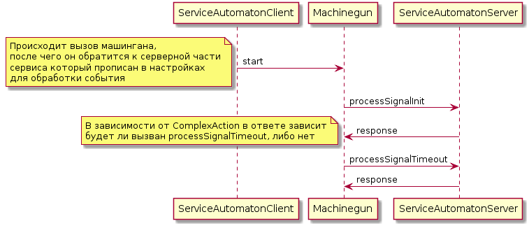
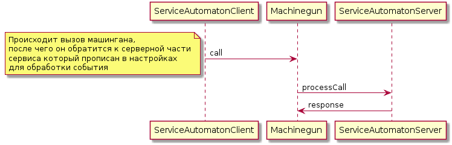

### Общая схема работы

> Для описания схем использовался: [PlantUML](http://plantuml.com/plantuml/form)


Когда `automatonClient` вызывает метод `start`, то запрос на обработку приходит в `processSignalInit`

Далее, в зависимости от `ComplexAction` он либо завершит работу, либо будет вызван далее в `processSignalTimeout`

Нужно помнить, что при обработке `processSignalTimeout` будут приходить все созданные события, а не последнее




```
@startuml
ServiceAutomatonClient -> Machinegun : start
note left
    Происходит вызов машингана,
    после чего он обратится к серверной части
    сервиса который прописан в настройках
    для обработки события
end note
Machinegun -> ServiceAutomatonServer : processSignalInit
ServiceAutomatonServer -> Machinegun : response

note left
    В зависимости от ComplexAction в ответе зависит
    будет ли вызван processSignalTimeout, либо нет
end note

Machinegun -> ServiceAutomatonServer : processSignalTimeout
ServiceAutomatonServer -> Machinegun : response
@enduml
```


При вызове метода `call` запрос уйдет в обработчик `processCall`



```
@startuml
ServiceAutomatonClient -> Machinegun : call
note left
    Происходит вызов машингана,
    после чего он обратится к серверной части
    сервиса который прописан в настройках
    для обработки события
end note
Machinegun -> ServiceAutomatonServer : processCall
ServiceAutomatonServer -> Machinegun : response
@enduml
```